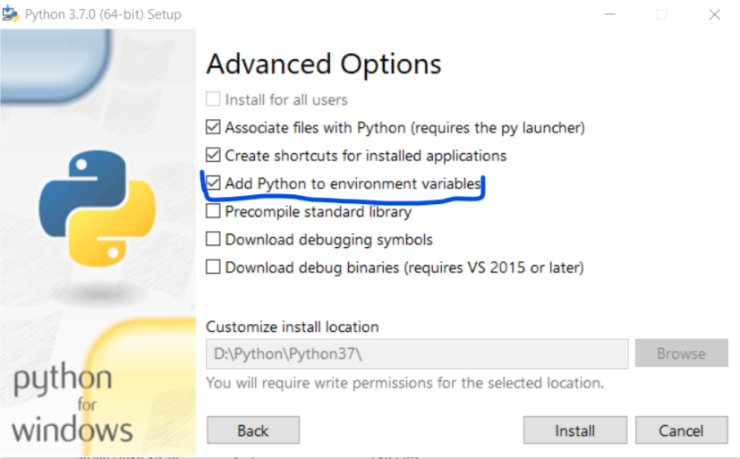
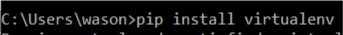
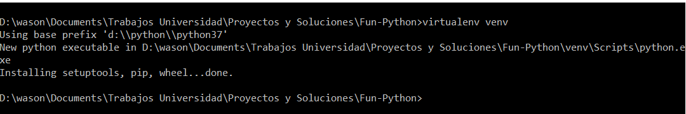
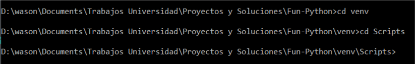
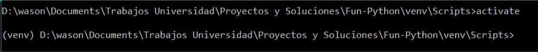

# How To Use Fun-Python

This library is ment to be runned from the command line.

## Step by Step guide

1. Install [Python](https://www.python.org/downloads/) 3.6.6 or 3.7.0 are fine. _for tensor flow you **will need** 3.6.6_
1. Make shure you added python into the environment variables on windows, is a checkbox at installation (on windows).
1. Install `virtualenv`, this will allow you to make your own python environments.

    1. Open your command line and type: `pip install virtualenv`
    
    1. Open the directory in which you would like to create an environment and type `virtualenv [the name of yor virtual enviroment]`, mainly i use venv so the command should look like this: `virtualenv venv`.
    

1. Activate your virtual environment:

    1. So after you created a virtual environment you need to activate it, so go to the directory in which you created it, inside a folder called venv you will find many other folders, go to the one called scripts, and inside it open a terminal or cmd and type: `activate`
    
    1. Now you will see a change on the cmd, that lets you know you are running commands on your virtualenv
    
    (the little parenthesis with the venv)

1. Install the library’s for this project

    - With your virtual environment activated type the following commands:
    - For pygame `pip install pygame`
    - For numpy `pip install numpy`
    - For tensorflow `pip install https://storage.googleapis.com/tensorflow/windows/cpu/tensorflow-1.11.0-cp36-cp36m-win_amd64.whl` (you can go to the [TensorFlow](https://www.tensorflow.org/install/pip) official website for more info on downloads and installation

1. Run the code!, simply go to the location of your script, with the virtual environment activated and run `python TheNameOfYourFile.py`

You are all set, have fun using these examples to learn, they are great ones.

If you want me to change anything or add new examples, you can let me know with an issue.
